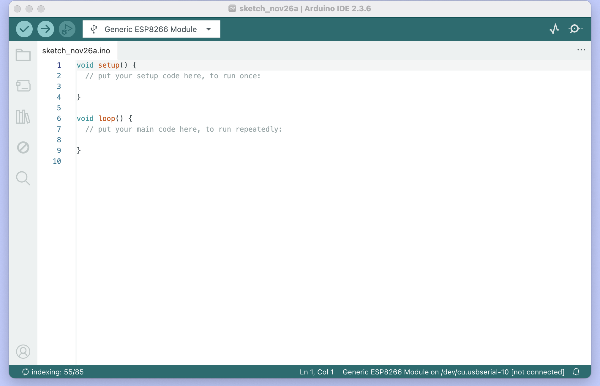
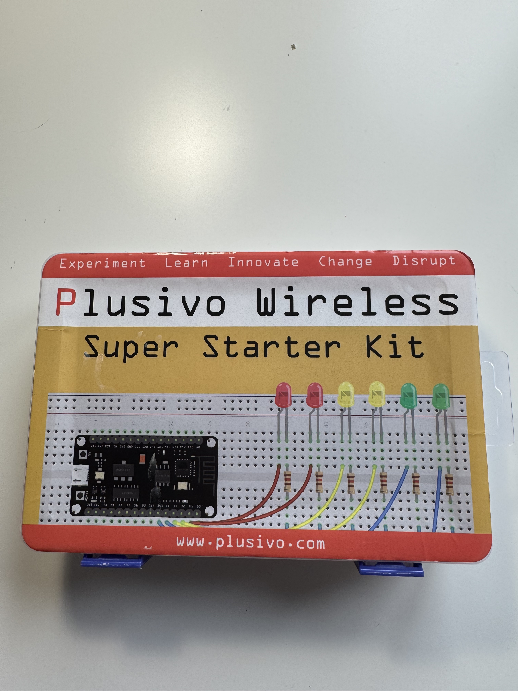

# Instruktion för att utföra *blink* med Arduino IDE och Pulsivo 

I detta repo redogör jag för hur man genom Arduino IDE och Plusivo kan utför "blink" funktionen på en NodeMCU micro controller.

## Förutsättningar 
För att kunna utföra detta behöver du följande:
* ladda ner mjukvaroprogrammet Arduino IDE till din dator och ett Pulsivo kit med en NodeMCU micro controller, dessa ser ut på följande sätt:

  
  
  
  

## Förbederelser Arduino och Pulsivo
När Arduino IDE är nedladdat behöver du göra följande:

1. Öppna programmet och `klicka`på progammtiteln i vänstra hörnet, därefter gå till *preferences* och klistra in följande URL-kod: `https://arduino.esp8266.com/stable/package_esp8266com_index.json`
2. Gå till *borads manager* och skriva in `esp8266`och installera ( de kan ta tid, var tålmodig)
3. Gå in på *Tools* -> *board* och tyck på *esp8266* -> välja versionen högst upp som heter `Generic ESP8266 Module`

När ovanstående är klart öppna ditt Pulsivo kit och se till att du har följande:
* NodeMCU (microcontroller)
* Breadborad (för att fästa micro controller på) 
* USB/ USB-C cable - Type A. Beroende på vilken dator du har behöver du viss kabel, en Mac behöver en USB-C och en Windows behöver en USB. 
   
## Testa *blink* funktion

1. Öppna upp Arduino IDE och gå till *File* -> *exampels* -> *01 basic* och välj *blink*
2. Ett nytt fönster kommer öppnas upp med C++ koden man behöver för att utföra *blink*, det är där du vill vara. Om man scrollar ner till rad 25-37 ser man koden som körs och behövs för att utföra testet, mer om den kommer längre ner. 
3. Fäst micro controllerns pinnar/ben i *breadbordet* 
4. Koppla in Type A kablen i micro controllern där de finns en port och USB (C) delen i din dator.
5. På Arduino gå in på *Tools* -> *Port* och välj Microcontrollern ( Den kan heta olika på olika enheter, är du orsäker på vilken som är rätt, koppla ut saldden från datorn och titta vilka som brukar finns under *port*, koppla in sladden igen och välj den som är ny.)
6. Klicka på *veryfi* och sedan *upload* ikonerna ->  Detta kan ta lite tid, ha tålamod, den kommer micro controllern börja blinka!

## koden för *blink* funktion 

* koden som finns i rad 26 - 36 består av två delar `void setup` och `void loop`.
* `Void setup` är en funktion som finns i Arduino IDE och som körs endast när micro controller startas upp eller startas om, om man exemplvis gör några ändringar i `void loop`.
* ` Void loop ()` innebär att koden inom () ska utföras om och om igen.
*   Bland annat består denna koden av två  `delay (1000)` detta betyder att programmet ska pausa i x-antal millisekunder ( koden är förinställd på 1000 millisekunder), vilket gör att lampan blinkar progremmet pausar när lampan är på och pausar när lampan är av. 
* Denna tid kan man ändra genom att exempelvis ta bort en nolla, eller fler. 

*Jag testade att ta bort alla nollor, vilket innebär att pausen sker på 1 miliskeund och återupptas på 1 miliskeund. Eftersom detta sker så snabbt uppfattar vi de som att lampan lyser konstant istället.

kom ihåg att så fort du ändrar något behöver du tycka på verify och upload! Lycka till!

